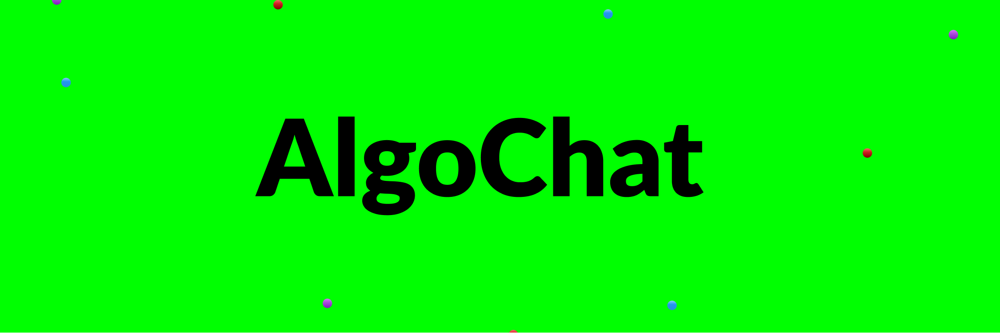

# AlgoChat

The `Algorand` blockchain is a cutting-edge technology that has the potential to revolutionize the way we interact with the decentralized world. To better understand Algorand technology and its capabilities, the AlgoChat team has developed its own GPT-3 bot “AlgoChat” to answer all your doubts about the Algorand ecosystem. This bot is built using OPENAI and features a fantastic user interface, that gives you the sense of chatting with a friend.

## Welcome 👋 to AlgoChat

## Problem

When we want to search or explore anything related to Algorand on the web we need to go through loads links and webpages to get even a single answer, also its not fixed we are able to find the answer everytime.

## What we built 👨‍💻

The `AlgoChat` bot is designed to help users understand the basics of Algorand and its capabilities. The bot is equipped with a natural language processing engine that allows users to ask questions in a conversational format(we personalized it for our AlgoFam). The bot then uses its AI algorithms to find the most relevant answers from a vast database of information about Algorand.

## How it is solved ✨

To overcome this we built an onestop solution to this problem, we built a chatbot `AlgoChat` on the top of OpenAPI api, that answers all the questions related to Algorand Blockchain in a concise manner. Not also it gives text based reply but it also utters the answer which makes it more handy.

## Future Plans 

### Shortcomings:

Currently, the main problem that our AlgoChat is facing is the lack of proper prompting. It is also unable to answer code-related questions of PyTeal and Reach Languages.

### Future plans:

We will be fine-tuning our model for a more optimized and precise response in the future. We will also be increasing the word limit for the chat and will use the paid version of API for faster responses. Along with that, we will train AlgoChat about different projects of the Algorand ecosystem and their impact on the Algorand ecosystem.
